# GETNS Afterschool ECA Website

My goal is to create a simple, static website providing parents with clear, accessible information about the Extra-Curricular Activities (ECA) program at Glasnevin Educate Together National School. It includes a detailed class timetable, policies, and a streamlined application process to improve communication and engagement with the school community.

---

## Project Overview

This project aims to improve the way ECA information is presented and accessed by parents. By centralizing all essential afterschool activity information in one place, the site simplifies how parents explore class options and apply for them.

The site is built using custom HTML5 and CSS3 (with Bootstrap for layout). It is designed to be fully responsive and easy to navigate for all users on all device types.

---

## Key Goals of website

- **Improve Accessibility**: Make it easy for parents to view all available ECA classes.
- **Facilitate Enrollment**: Provide a clear and simple way to express interest or apply for classes without contacting each teacher individually
- **Reduce Admin Load**: Allow the ECA committee to direct parents to the site instead of repeating information.
- **Ensure Transparency**: Clearly outline policies and processes for participation.

---

## Target Audience

- **Primary Audience**: Parents/guardians of children attending GETNS who are interested in afterschool classes.
- **Secondary Audience**: Committee members and organizers of the ECA program.
- **Secondary Audience**: Children who may be shown the class information directly to make their class choices

---

## Features and Structure

The website includes:

1. **Homepage**
   - Introduction to the ECA program  
   - General information about class prices and how to apply

   

2. **Timetable & Class Information**
   - Grid view of available classes in card form
   - Each class contains key information (description, age group, schedule, fees, etc.)

    
   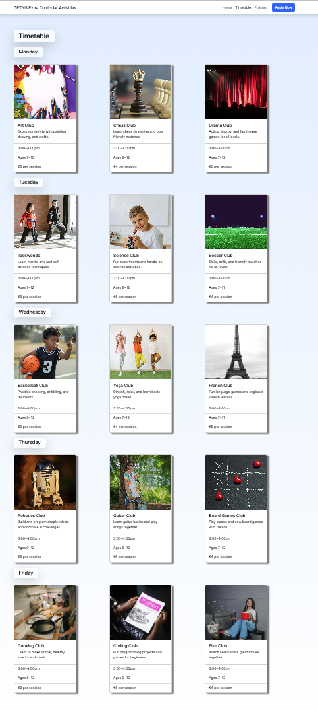 
   Timetable page on desktop
    
   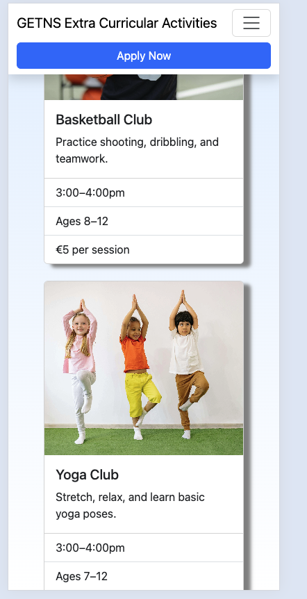 
   Timetable page on mobile

3. **Application Process**
   - Simple application form accessible from anywhere onsite through the header
   - Required fields clearly marked and enforced in form structure
   - Confirmation page following completed application
         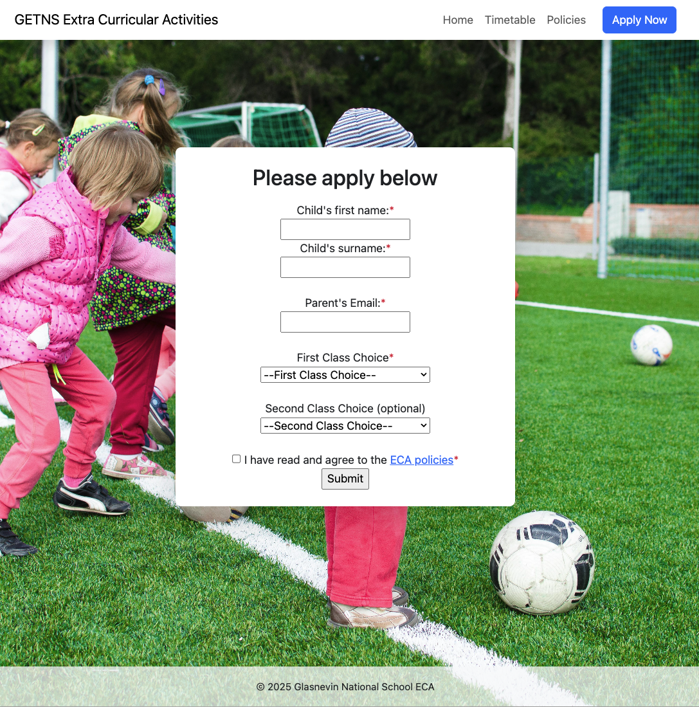
           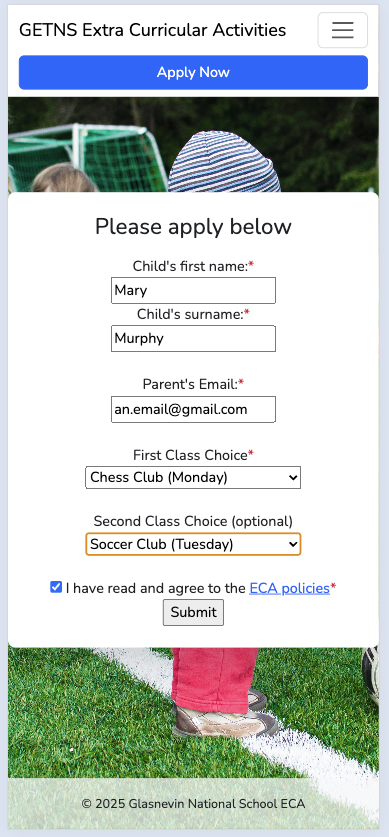
            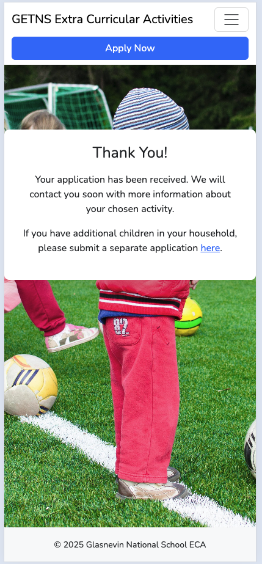

4. **Policies Page**
   - Code of conduct  
   - Safety and supervision guidelines  
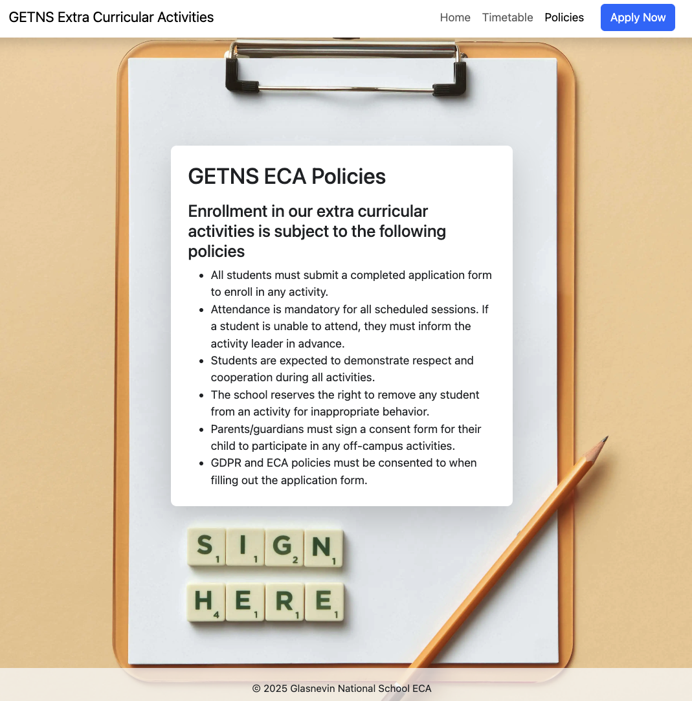
---

## User Story

> **As a parent with a child in the school, I want:**
- To see what classes are available for each term 
- To know what ages they are available for
- To understand how to enroll my child for the classes they're interested in
- Information about what to expect after enrollment, and when term starts

> **As a child in the school, I want:**
- Information about which classes are available
- Information about who provides the class (e.g. my teacher, an external provider?)

> **As a parent involved in running the committee, I want:**
- Somewhere to direct parents with questions to avoid repeating information about class timetable and where to find the form link

---

## Gallery

## Information Architecture

- Navigation menu accessible on every page  
- Clear layout with headings and sections  
- Mobile-friendly using responsive CSS including navbar

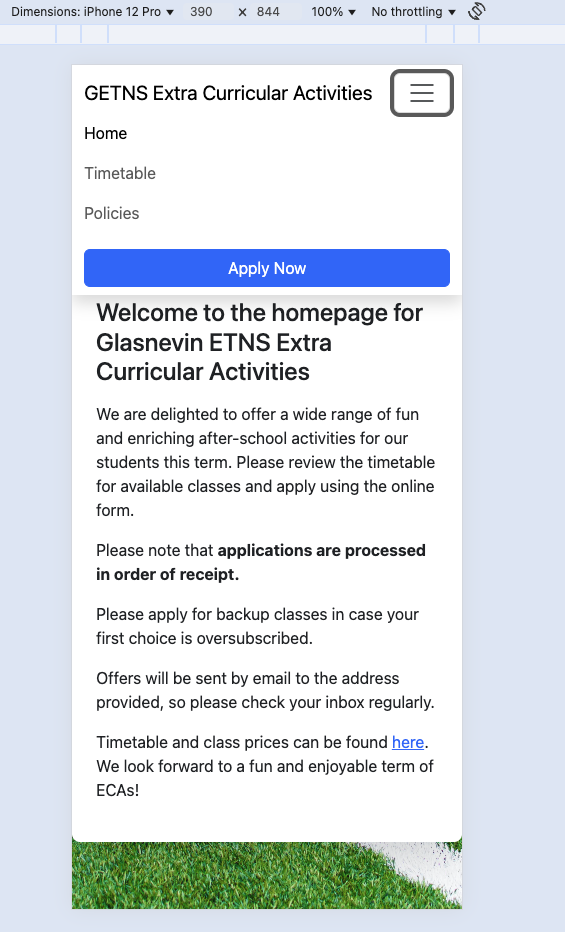

---

## Deployment

- For testing locally, I used `python3 -m http.server 8000` to start a local web server and visited http://localhost:8000 frequently when making changes 
- I then deployed publicly via **GitHub Pages** following GitHub's documentation [Github Pages](https://pages.github.com/) and this can be accessed here: [Milestone project afterschool clubs](https://github.com/Alanampersand/milestone-afterschool/settings/pages)

- You are welcome to clone this repository following the steps outlined in GitHub: https://docs.github.com/en/repositories/creating-and-managing-repositories/cloning-a-repository

---

## Attribution & Acknowledgements

- Custom code written by Alan Doyle through VSCode
- Layout assisted using [Bootstrap](https://getbootstrap.com/)
- Fonts from [Google Fonts](https://fonts.google.com/) (Nunito)
- Any borrowed code is clearly attributed inline and listed here.
- Special thanks to [Lewis Dillon](https://github.com/LewisMDillon) for facilitating our cohort and providing last minute advice and direction on necessary improvements to this project
- Application Form adapted from [W3 Schools](https://www.w3schools.com/html/html_form_input_types.asp)  

## Images sourced free from Pexels.com

### Favicon

- [children icons](https://www.flaticon.com/free-icons/children) gravisio - Flaticon

### Homepage Background
- [pexels-goumbik-296302.jpg](https://www.pexels.com/photo/296302/) by Lukas, Pexels

## Policies Background
- [pencil-and-letter-tiles-on-a-clipboard-8099630/](https://www.pexels.com/photo/pencil-and-letter-tiles-on-a-clipboard-8099630/) by DS stories, Pexels 

### Timetable Activity Cards
- **Art Club:** [Art supplies on table](https://www.pexels.com/photo/207666/) by Pixabay, Pexels
- **Chess Club:** [Chess board and pieces](https://www.pexels.com/photo/260024/) by Pixabay, Pexels
- **Drama Club:** [Children acting on stage](https://www.pexels.com/photo/713149/) by Pixabay, Pexels
- **Taekwondo:** [Child learning taekwondo](https://www.pexels.com/photo/7045555/) by RDNE Stock project, Pexels
- **Science Club:** [Child with microscope](https://www.pexels.com/photo/a-boy-in-white-shirt-sitting-while-holding-a-microscope-8923799/) by Pixabay, Pexels
- **Soccer Club:** [Children playing soccer](https://www.pexels.com/photo/399187/) by Pixabay, Pexels
- **Basketball Club:** [Basketball on court](https://www.pexels.com/photo/30637225/) by RDNE Stock project, Pexels
- **Yoga Club:** [Children doing yoga](https://www.pexels.com/photo/8613312/) by Yan Krukau, Pexels
- **French Club:** [Eiffel tower](https://www.pexels.com/photo/3721426/) by Matthis Volquardsen, Pexels
- **Robotics Club:** [Robot](https://www.pexels.com/photo/2085831/) by JÉSHOOTS, Pexels
- **Guitar Club:** [Child playing guitar](https://www.pexels.com/photo/32772329/) by RDNE Stock project, Pexels
- **Board Games Club:** [Board games on table](https://www.pexels.com/photo/220057/) by Pixabay, Pexels
- **Cooking Club:** [Children cooking](https://www.pexels.com/photo/1684032/) by Gustavo Fring, Pexels
- **Coding Club:** [Child coding on laptop](https://www.pexels.com/photo/1181671/) by ThisIsEngineering, Pexels
- **Film Club:** [Film reel and clapperboard](https://www.pexels.com/photo/8064761/) by Tima Miroshnichenko, Pexels

All images are used under the [Pexels license](https://www.pexels.com/license/). Please see each link for the original source and photographer/artist details.

---

## 🔧 Version Control

This project uses **Git** for version control and is hosted on **GitHub**:

> [https://github.com/Alanampersand/milestone-afterschool](https://github.com/Alanampersand/milestone-afterschool)

---

## 🧪 Testing

### HTML Validation
- All HTML files were validated using the [W3C Markup Validation Service](https://validator.w3.org/) as detailed below
- No errors or critical warnings were found after correcting minor issues around favicon name and other image name spacing

| Page         | W3C Validator URL                                                                 | Screenshot                                 |
|--------------|-----------------------------------------------------------------------------------|--------------------------------------------|
| index.html   | https://validator.w3.org/nu/?doc=https%3A%2F%2Falanampersand.github.io%2Fmilestone-afterschool%2Findex.html                                           | 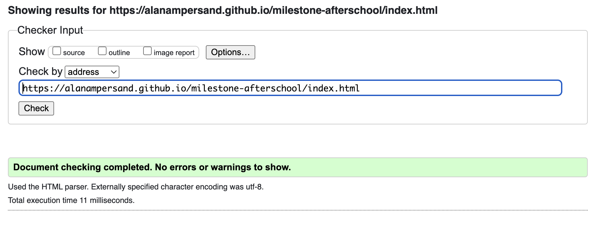|
| timetable.html| https://validator.w3.org/nu/?doc=https%3A%2F%2Falanampersand.github.io%2Fmilestone-afterschool%2Ftimetable.html                                | 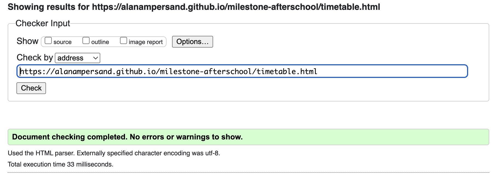 |
| appform.html | https://validator.w3.org/nu/?doc=https%3A%2F%2Falanampersand.github.io%2Fmilestone-afterschool%2Fappform.html                                  | 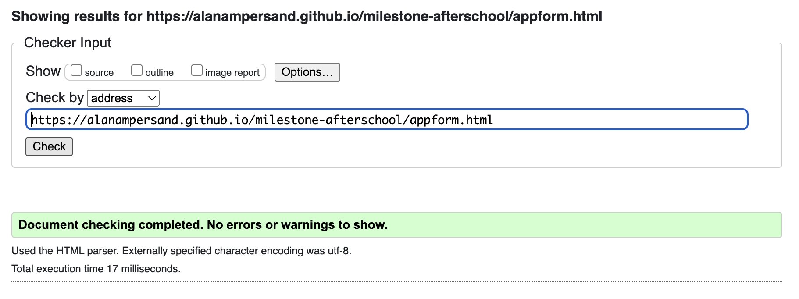     |
| policies.html| https://validator.w3.org/nu/?doc=https%3A%2F%2Falanampersand.github.io%2Fmilestone-afterschool%2Fpolicies.html                                 | 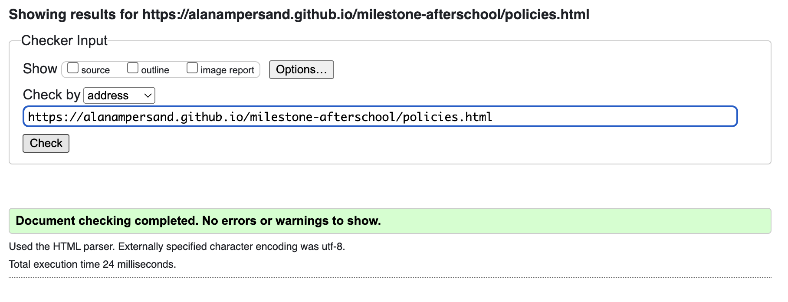   |
| confirmation.html| https://validator.w3.org/nu/?doc=https%3A%2F%2Falanampersand.github.io%2Fmilestone-afterschool%2Fconfirmation.html                         | 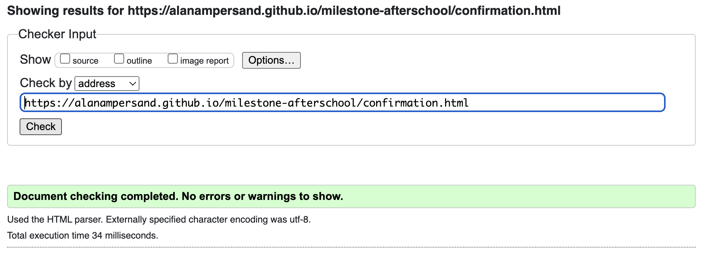 |

### CSS Validation

- All CSS files were validated using the [W3C Jigsaw Validation Service](https://jigsaw.w3.org/css-validator) as detailed below

| Page         | W3C Validator URL                                                                 | Screenshot                                 |
|--------------|-----------------------------------------------------------------------------------|--------------------------------------------|
| style.css.   | https://jigsaw.w3.org/css-validator/validator?uri=https%3A%2F%2Falanampersand.github.io%2Fmilestone-afterschool%2Findex.html&profile=css3svg&usermedium=all&warning=1&vextwarning=&lang=en                                           | 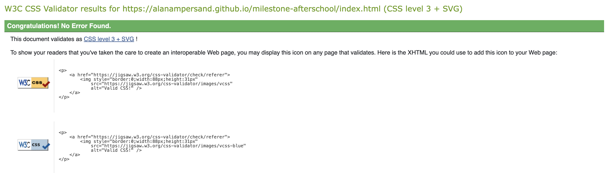   

### Accessibility & Performance (Lighthouse)
- The site was tested using [Google Lighthouse](https://developers.google.com/web/tools/lighthouse) in Chrome DevTools and received top results in all areas.

| Page      | Lighthouse Report URL                                                                                                         | Screenshot                                      |
|-----------|------------------------------------------------------------------------------------------------------------------------------|-------------------------------------------------|
| mobile site | [Lighthouse Mobile Report](https://pagespeed.web.dev/analysis/https-alanampersand-github-io-milestone-afterschool/sj6ygx85ou?form_factor=mobile) | 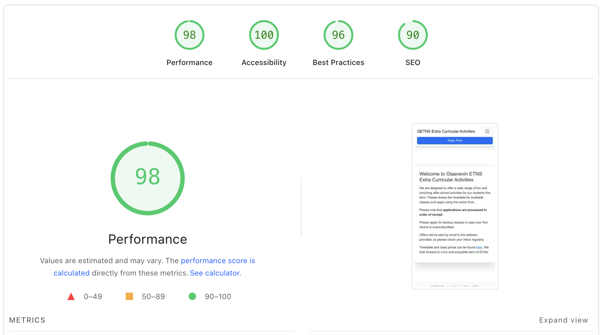 |
| desktop site | [Lighthouse Desktop Report](https://pagespeed.web.dev/analysis/https-alanampersand-github-io-milestone-afterschool/sj6ygx85ou?form_factor=desktop) | 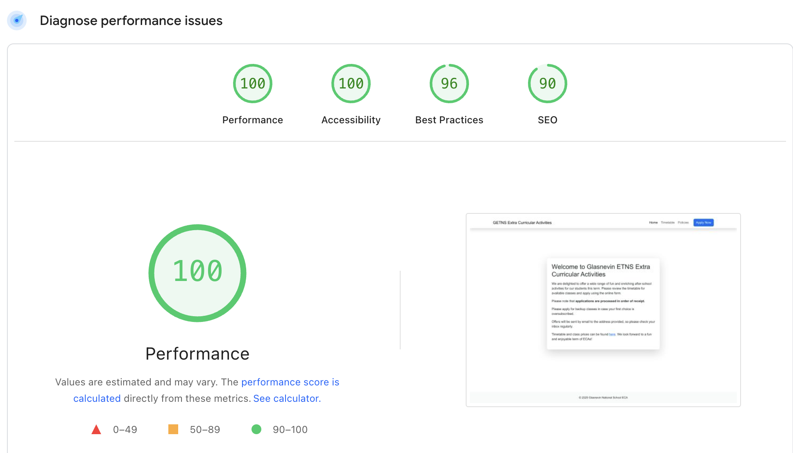 |
**Key results:**
- **Performance:** Fast load times and responsive layout.
- **Accessibility:** All images have alt text, color contrast is sufficient, and navigation is keyboard accessible.
- **Best Practices:** No major issues detected.
- **SEO:** All pages have appropriate meta tags and semantic structure.

### Manual Testing
- The site was tested on multiple devices (desktop, tablet, mobile) and browsers (Chrome, Firefox, Safari, Edge) and found to be functional and performant.
- All navigation links, forms, and buttons were checked for correct operation, with required fields enforced and correctly labelled in the UI
- Responsive layout and sticky navigation/footer were verified.

---

